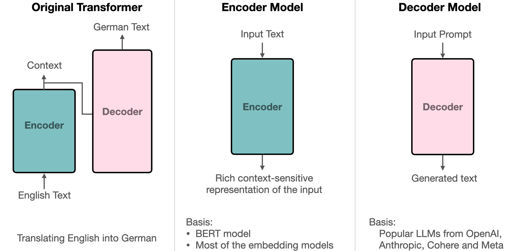
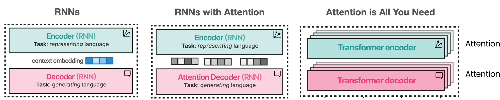
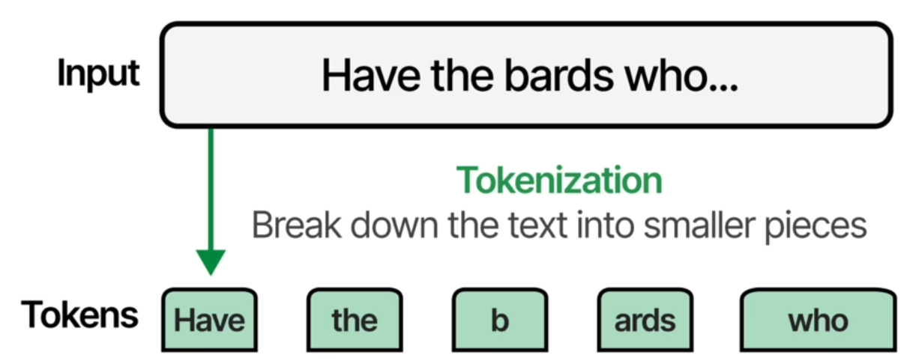
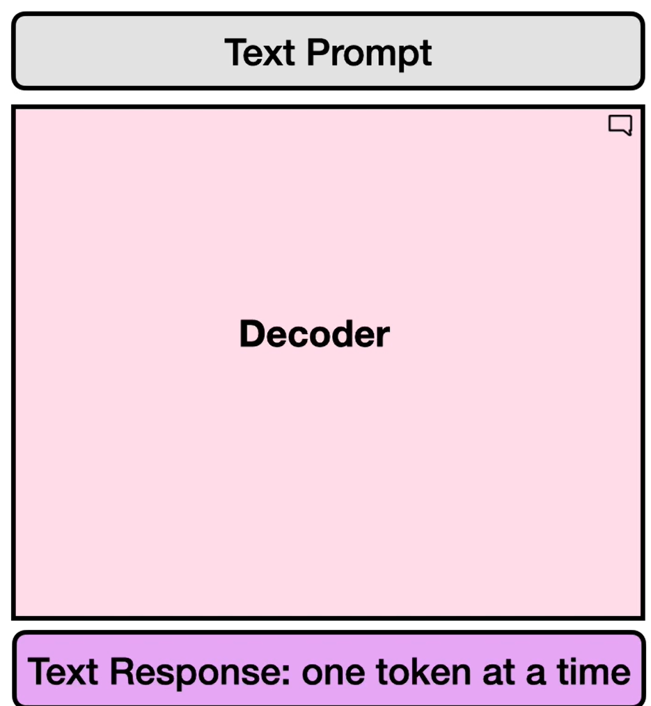
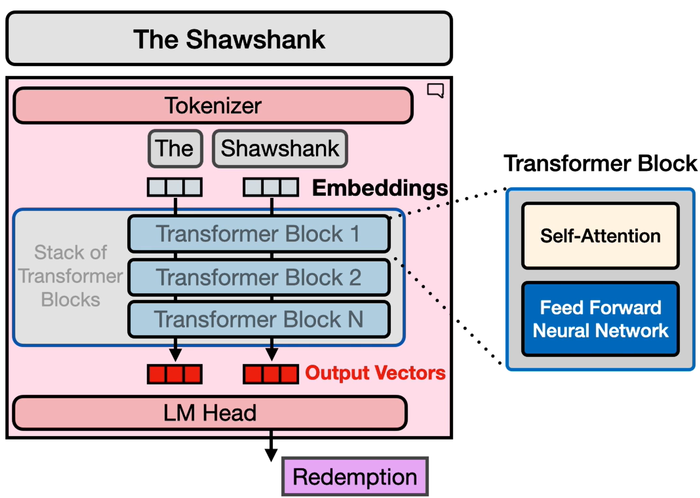

# Introduction

## Transformer

- 

## Course Outline

- Delve into recent developments in LLMs
  
- Learn about tokenization
  
- Gain intuition about how transformers work
  - Focussing on Decoder
  
  - Decoder example
  
