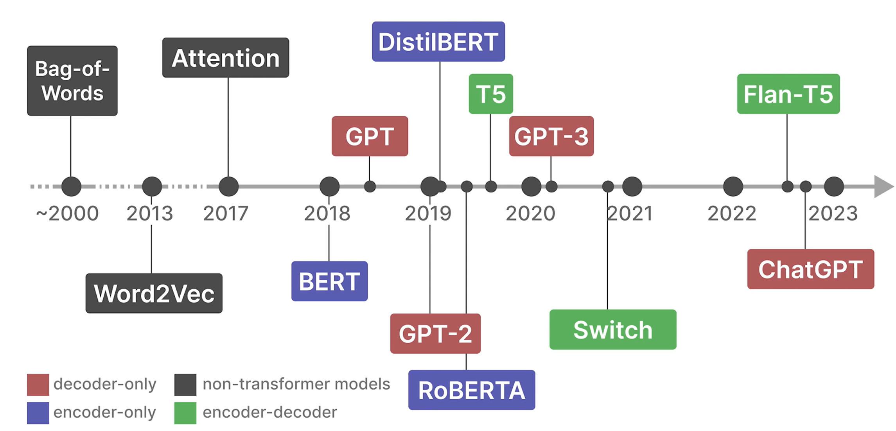
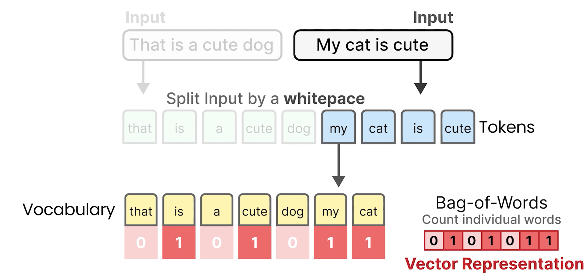

# Understanding Language Models: Language as a Bag-of-Words

- We'll learn the evolution of how language has been represented numercially
  - Bag of Words
    - Represents words as large sparse vectors or arrays of numbers
    - These numbers simple record the presence of words
  - Word2Vec
    - Word representation capture the meaning of words in the context of a few neighboring words
  - Transformers
    - Dense vectors captured the meaning of words in the context of a sentence or a paragraph
- Recent history of Language AI
  
- Language as a Bag-of-Words
  
