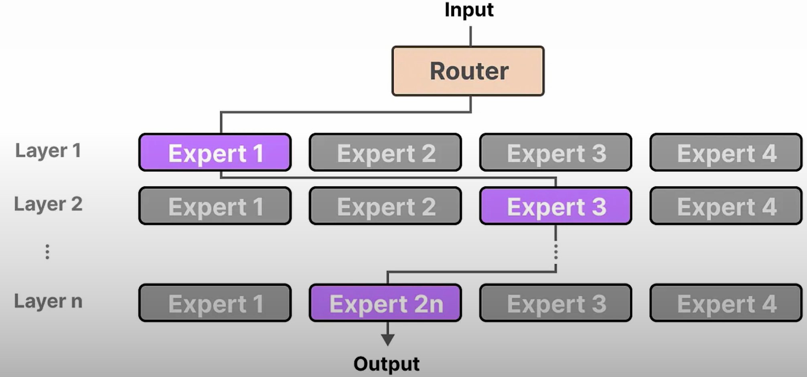

# Recent Improvements

- Transformer model
  - Detailed
    
  - Simplified
    
- Encoder models
  - Utilized for text embeddings, re-rankers
- Decoder models
  - Utilized for text generation
- 2017 vs 2024 era Transformer
  
  - Transformer block of 2024-era Transformer like Llama 3 features some tweaks
    - Pre-normalization
    - Attention optimized with grouped-query attention and rotatory embeddings
    - Positional encoding moved from 1st step to intermediate step

## Efficient organization of training data

- Presence of large number of short documents lead to usage of lot of padding
  - Leads to inefficient use of GPUs
- This requires specific positional encoding properties
- Rotatory embeddings is required to deal with training data packing having multiple documents in one row
  - It needs to identify 1st token and so on for each of the document

## Rotatory Embeddings (RoPE)

- Adds positional information at the self-attention layer of each transformer block

- Keys with positional information embeds the knowledge of position among the different vectors

## Mixture of Experts (MoE)

- Routers acts as classifier
- Uses multiple sub-models to improve the quality of LLMs
- Recommended blog: [A Visual Guide to Mixture of Experts (MoE)](https://newsletter.maartengrootendorst.com/p/a-visual-guide-to-mixture-of-experts)

### Intuition #1

- Each of the experts should not be considered as one monolithic component
- Rather each layer has a set of experts that specialize in dealing with specific tokens

### Intuition #2

- "Experts" are **not specialized** in specific domains like "Psychology" or "Biology"
- Rather these "experts" might tend to focus on specific kind of tokens, and focus on how to process them best.

- Router at each layer chooses the best expert(s) to process the input vector
- ?? Do each layer represent FFN component of a transformer block

- MoE component replaces the single FFNN

