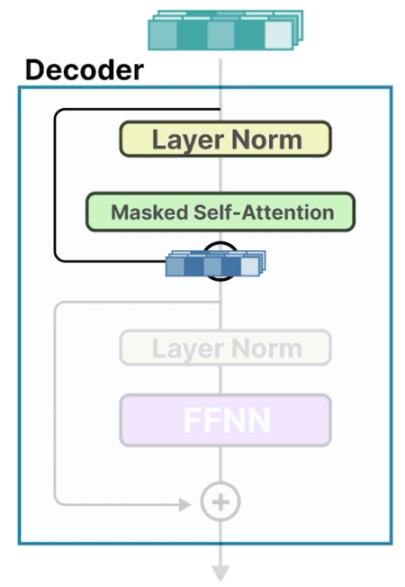

# Mixture of Experts (MoE)

## Lesson Objective

- Learn two components of MoE
  - Experts
  - Router

## A Dense Neural Network

- Attention layer prepares the input in such a way that more contextual information is stored in the vectors.

- Dense Network: All parameters are utilized
- This network is typically one of the largest components of an LLM.

## What are Experts?

- Expert is not specialized in a specific domain like psychology or biology.
- At most, it learns syntactic information on a token level.

- Sparse model
  - Since only a subset of experts are activated at a given time.
  - Often referred as Mixture of Experts (MoE) layer.

## Routing the input

- Router takes the input data and selects the best suited experts for this particular input.
- Router is a feed-forward neural network itself but quite small compared to experts.

- Router can choose single or mltiple experts.
- In case of multiple experts, final output is a weighted sum with weights being the probability scores.

## Computational Requirements

- The parameters used in MoE can be found in roughly five different places:
  - Input embeddings
  - Masked self-attention
  - Router
  - Experts
  - Output embeddings

- Sparse Parameters
  

- Active Parameters
  
  - Though all experts need to be loaded into memory, but only a subset is utilized for inference.

- Computing parameters in Mixtral 8x7B
  
  - Sparse vs Active parameters

- Pros and Cons
  - VRAM
    - High for loading
    - Low for inference
  - Overfitting risk
    - Risk of overfitting on a single expert
    - Requires careful balancing of the model
  - Performance
    - Tends to be higher than traditional models as the experts help remove redundancy in computations
  - Architecture
    - Complex: Needs careful training
    - Flexible:
      - Flexible in the experts that are chosen and used
      - Since MoE layer impacts only the feedforward layer and not the attention layer, it can be used by state space models e.g. Mamba and Zamba
