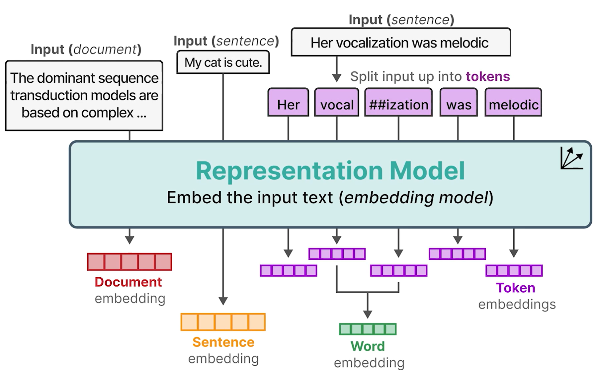

# Understanding Language Models: (Word) Embeddings

- **Bag-of-Words**
  - Does not consider the semantic nature of text
- **Word2Vec**
  - Could capture meaning of words in vector embeddings through neural networks
  - If the two words tend to have the same neighbor, their embeddings will be closer to one another and vice versa.

## Types of Embeddings

- Words are split into tokens based on the vocabulary of the tokenizer.
- Word embedding is created by averaging the embeddings of its split tokens.
