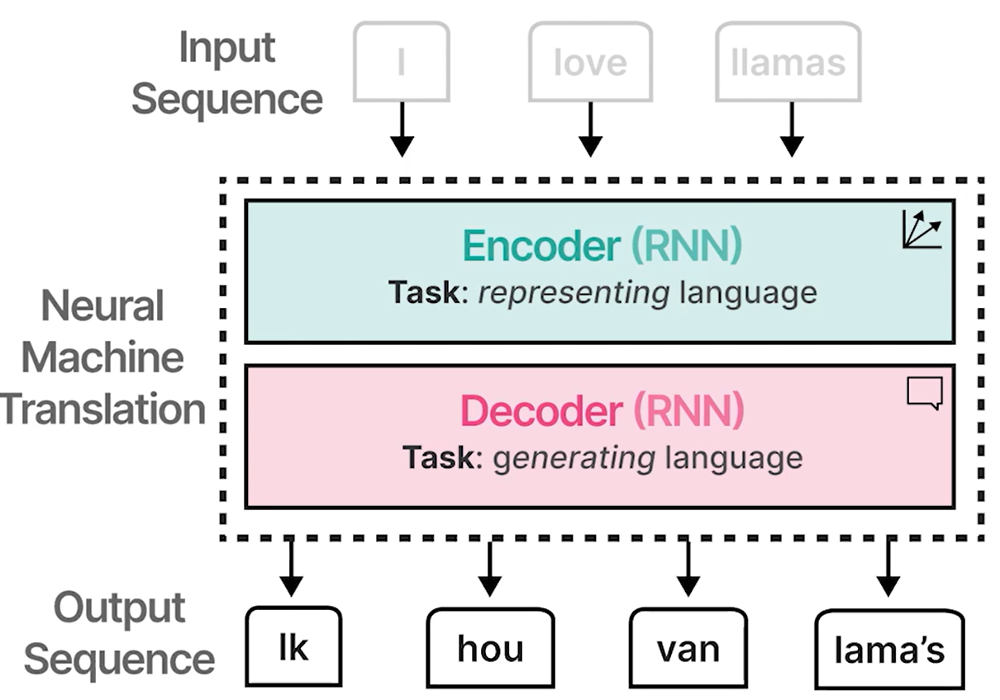
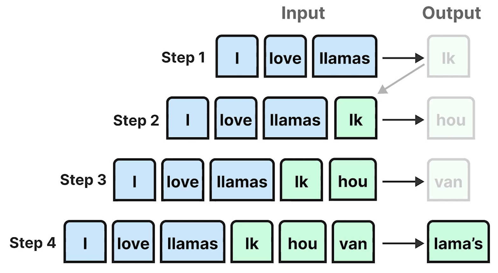
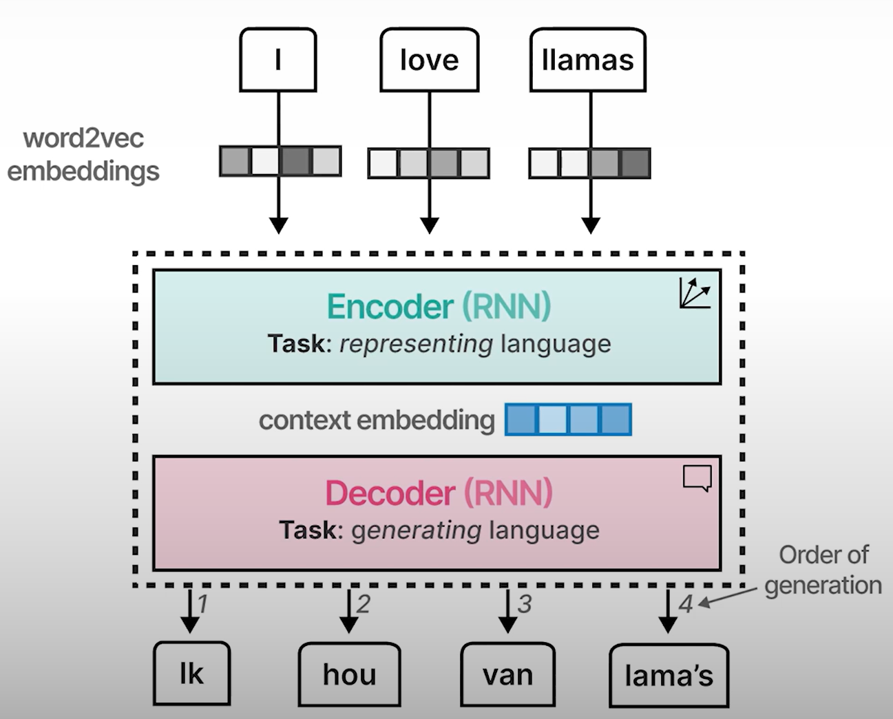
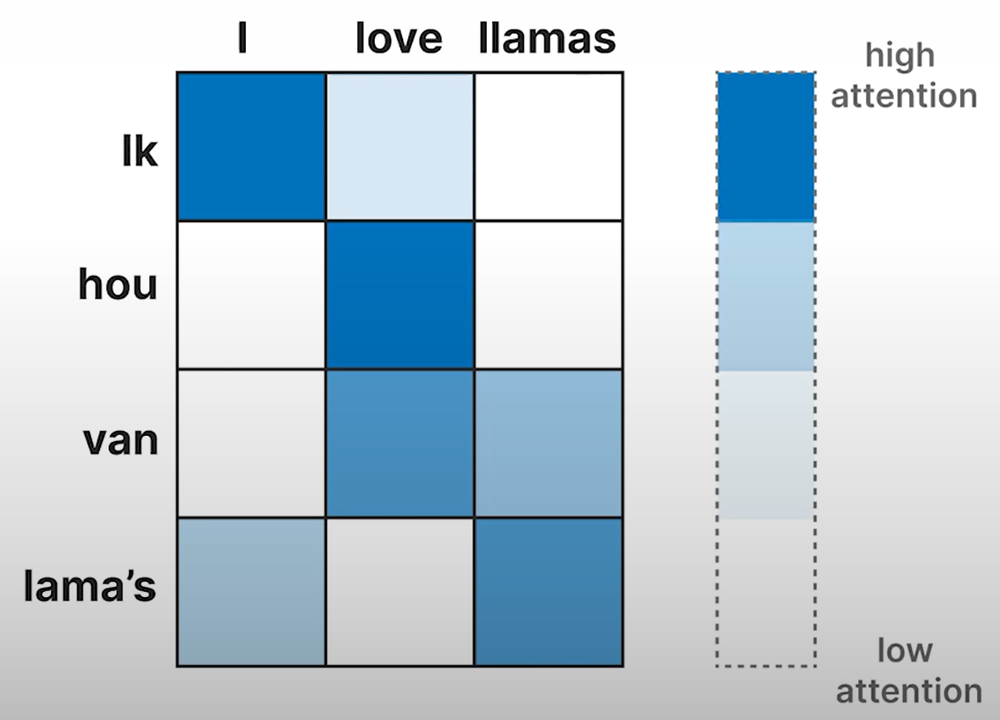
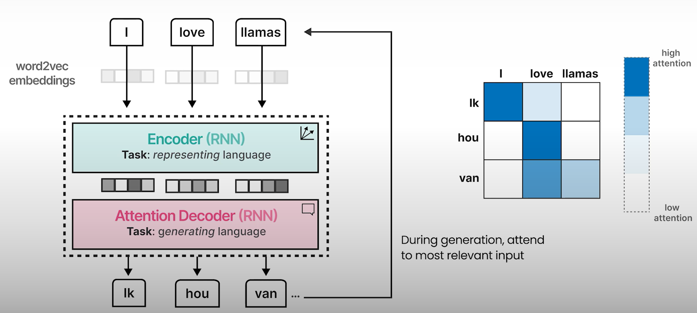

# Understanding Language Models: Encoding and Decoding Context with Attention

- **Word2Vec** creates static embeddings
  - The same embedding is generated for the word "**bank**" regardless of the context.
    - It fails to discriminate the context whether its a financial institution or a river bank.
- **Recurrent Neural Networks (RNNs)**
  - Used to model entire sequences
  - A approach to consider the context dynamically
  - Example: Translate English sentence to Dutch sentence
  

## Auto-Regressive

- Generates one token at a time
  

## Encoding and Decoding Context

- Drawback
  - Context embedding is a single embedding for the entire sequence of text.
  - It might not be adequate to capture the context of long sequence.

## Attention

- Attention allows a model to focus on parts of the input that are relevant to one another
- "Attend" to each other and amplify their signal

## Autoregressive

- Due to attention mechanism, the output tends to be much better since we now look at the entire sequence using embeddings for each token instead of the smaller and more limited context embedding.
- The sequential nature of this architecture precludes parallelization during training of the model.
