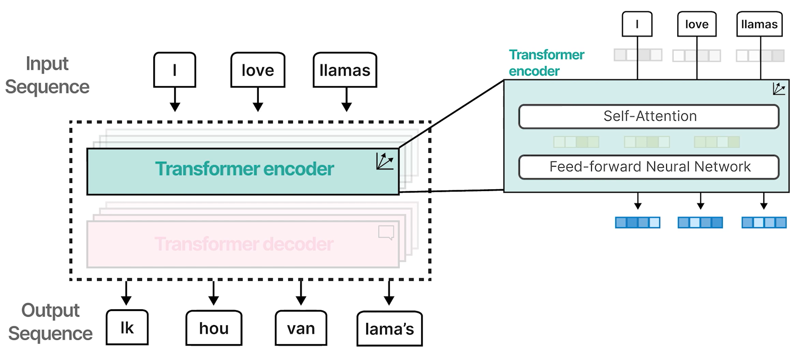
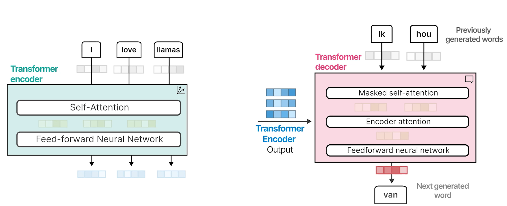
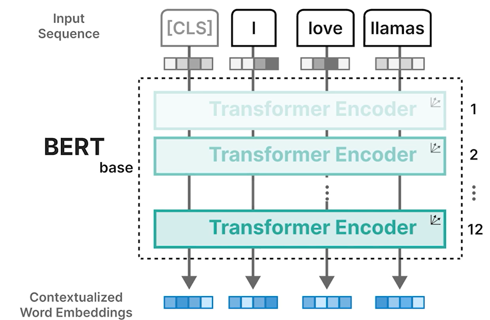
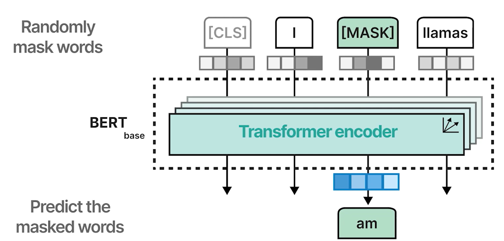
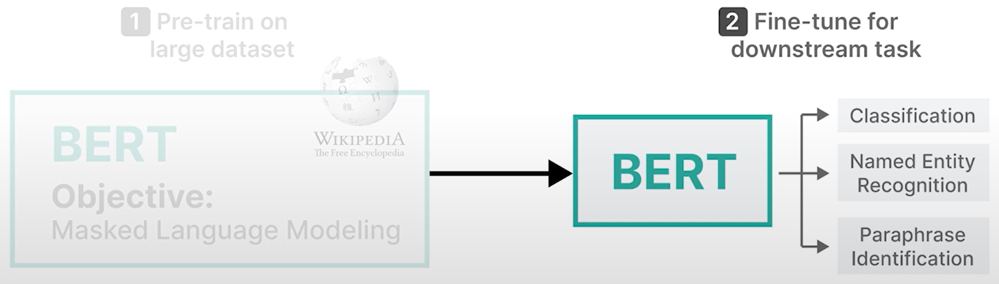
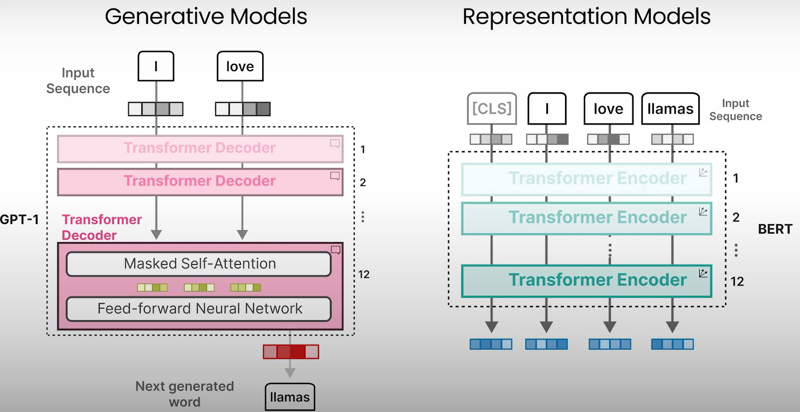
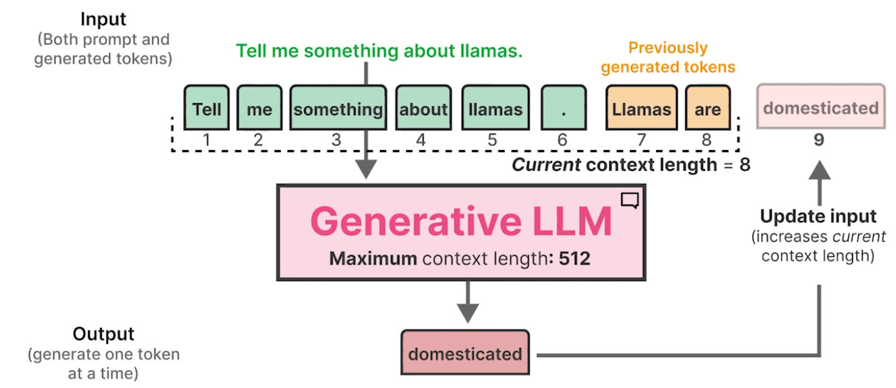
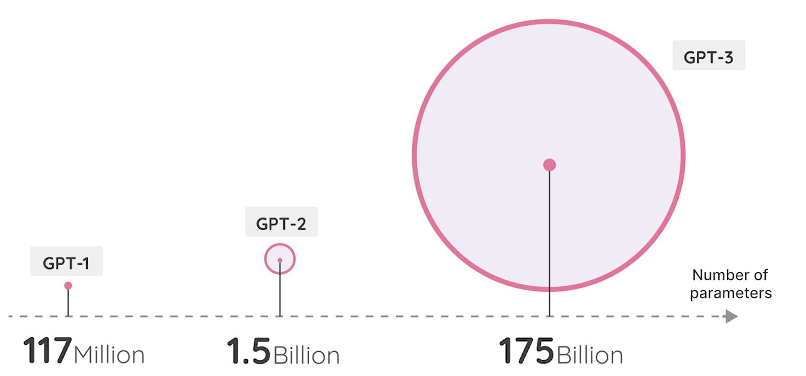
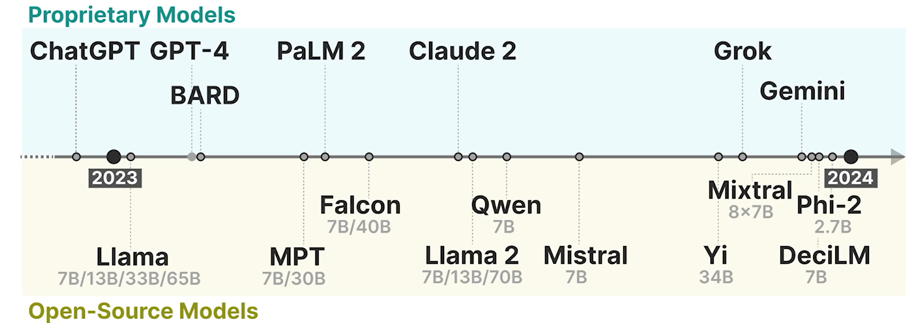

# Understanding Language Models: Transformers

## Attention is All You Need

- **Transformer**
  - A new architecture solely based on attention and without the RNN
  - Could be trained in parallel which speeds up calculation significantly
  - Stacking these blocks amplify the strength of the encoder and decoders.

  

  

## Representation Models

### Bidirectional Encoder Representations from Transformers (BERT)

- BERT focusses on representing language and generating contextual word embeddings
- [CLS] token (classification token)
  - Additional input token: Used as a representation for the entire input
  - Often used as the input embedding for finetuning the model on specific tasks like classification
- Masked Language Modeling
  - Training
    - Randomly some of the words in the input sequence are masked
    - Model is trained to predict these masked words
    - By doing so, the model learns to represent language as it attempts to deconstruct these masked words
    
  - Traning is a two-step process
    

## Generative Models

### Generative Pre-Trained Transformer (GPT)

- Embeddings are randomly initialized

### Context Length

### Parameters

## Year of Generative AI

