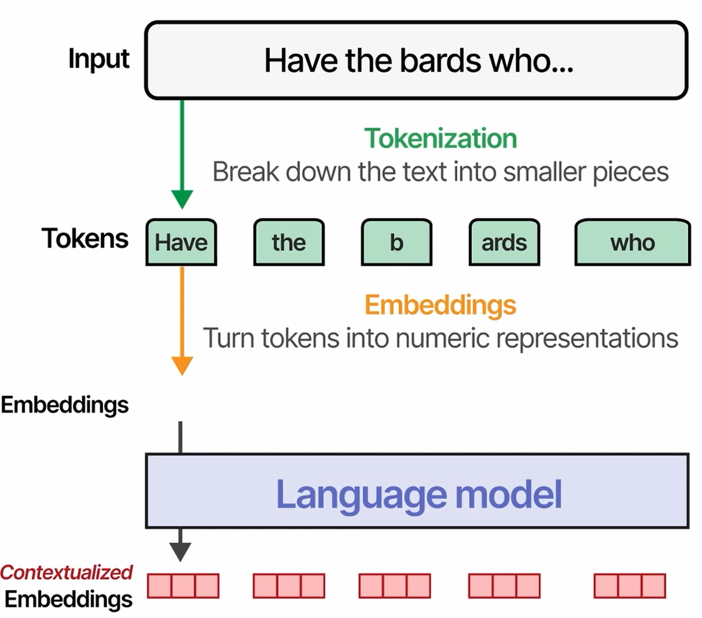
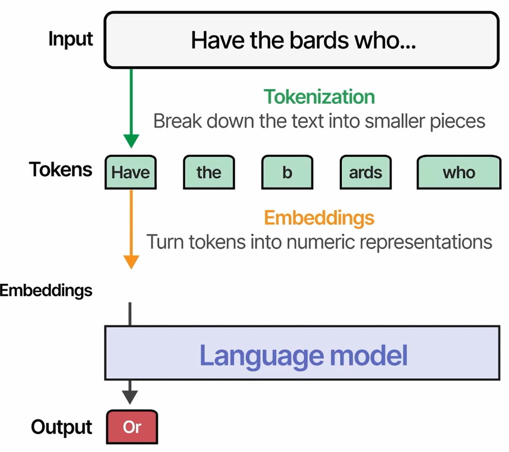
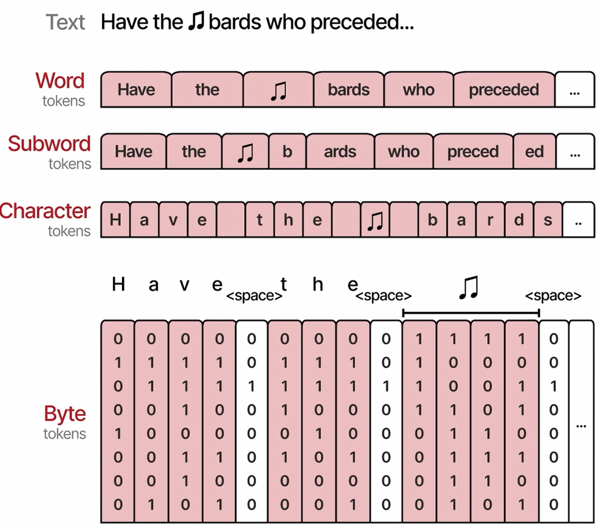

# Tokenizers

- Contextualized Embeddings:
  - One embedding per input token, but processed considering all other tokens.

- Output can be either contextualized embeddings or used by model to create output.
  - In case of generative model, this output can be a token.
  
- Tokenization levels
  - Note Symbol is represented with multiple bytes
  - Most Language models use subword level tokenizer
  

## Notebook

- [Jupyter Notebook](../code/L5.ipynb)
- Explore tokenization by different tokenizers
- ANSI Escape Codes
  - Utilized to color the text font/background
  - Resources
    - [tforgione](https://tforgione.fr/posts/ansi-escape-codes/)
    - [Jakob Bagterp's page](https://jakob-bagterp.github.io/colorist-for-python/ansi-escape-codes/standard-16-colors/)
      - Suggests Python library [colorist](https://github.com/jakob-bagterp/colorist-for-python)
    - [Wiki page](https://en.wikipedia.org/wiki/ANSI_escape_code)
