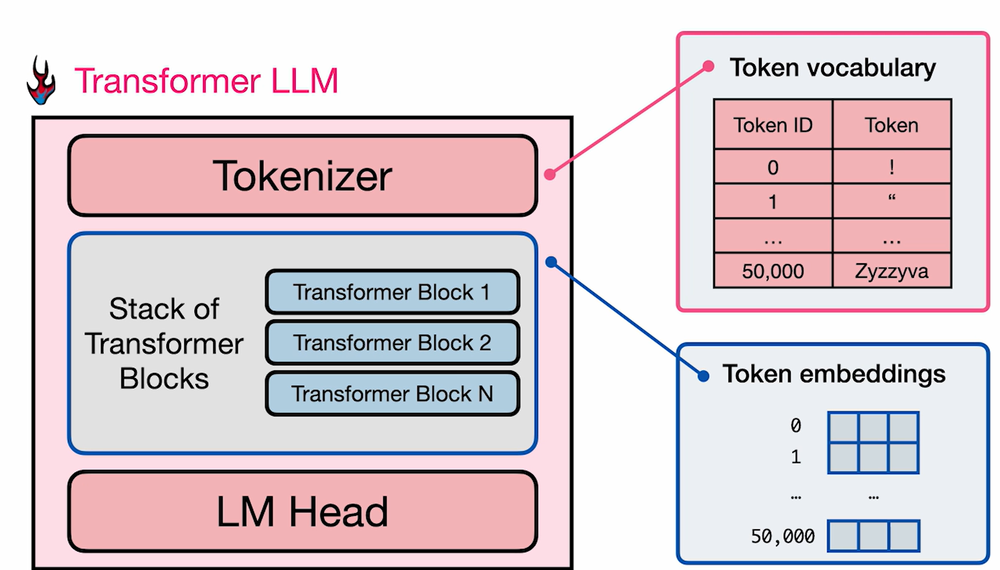
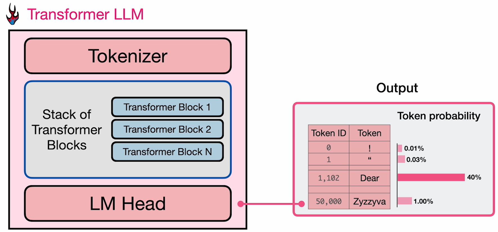
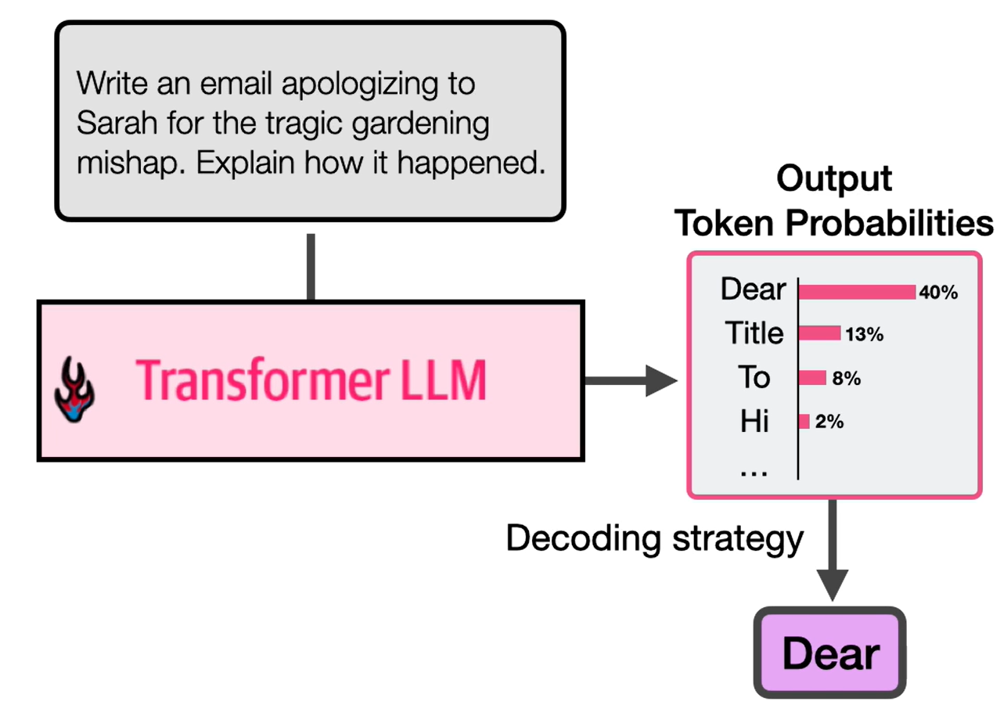
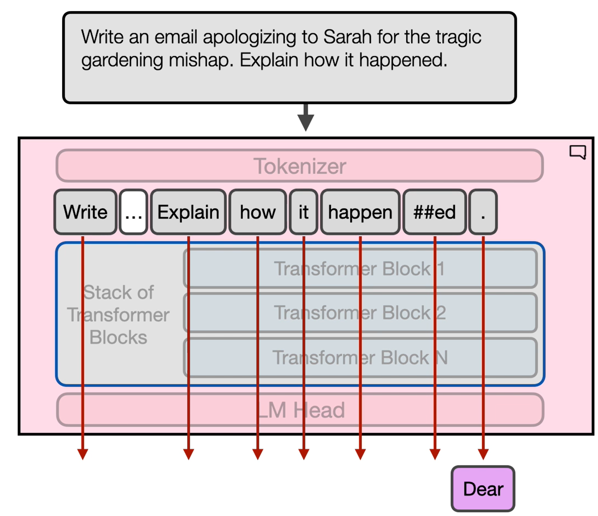
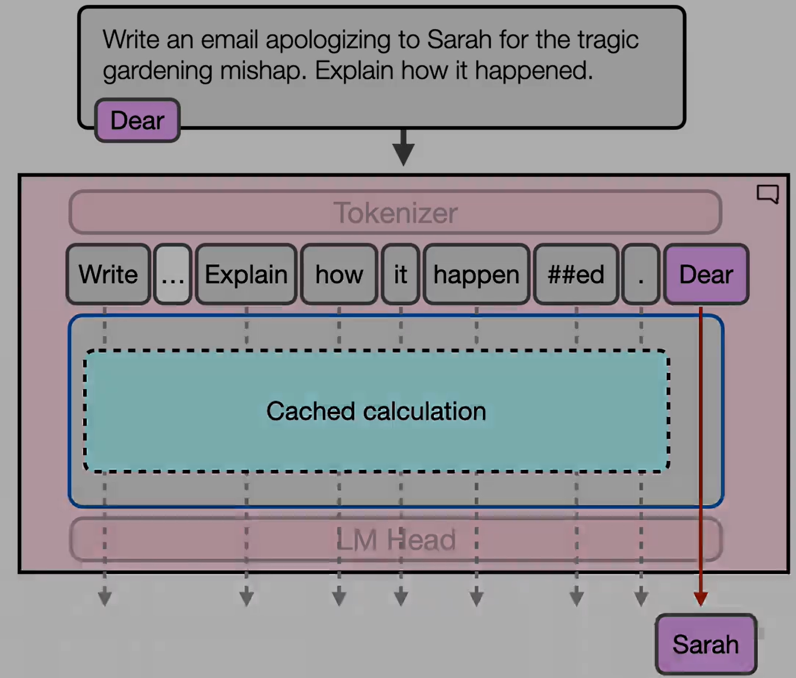

# Architectural Overview

- Three major components:
  - Tokenizer
  - Stack of Transformer Blocks
  - Language Modeling Head

- Tokenizer holds a vocabulary, the model contains token embeddings
  
- Language Model head scores the best (most probable) next token to output
  

- Multiple decoding strategies exist to choose the best output token
  
  - Choose the highest
    - `temperature` = 0
    - Greedy decoding
  - Choose `top_p`
    - This considers multiple tokens based on their probability i.e. not limited to the highest probable one.
  - Add randomness
    - `temperature` > 0

- Multiple tracks in parallel
  - Number of tracks = Context length
  
  - Generated output token in transformer is the output of the final token.
  - TTFT: Time to First Token
    - Time taken by model to process the above shown calculation

- KV Caching
  
  - Post 1st token generation, input also contains the generated tokens.
