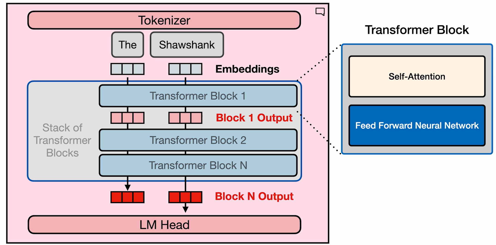
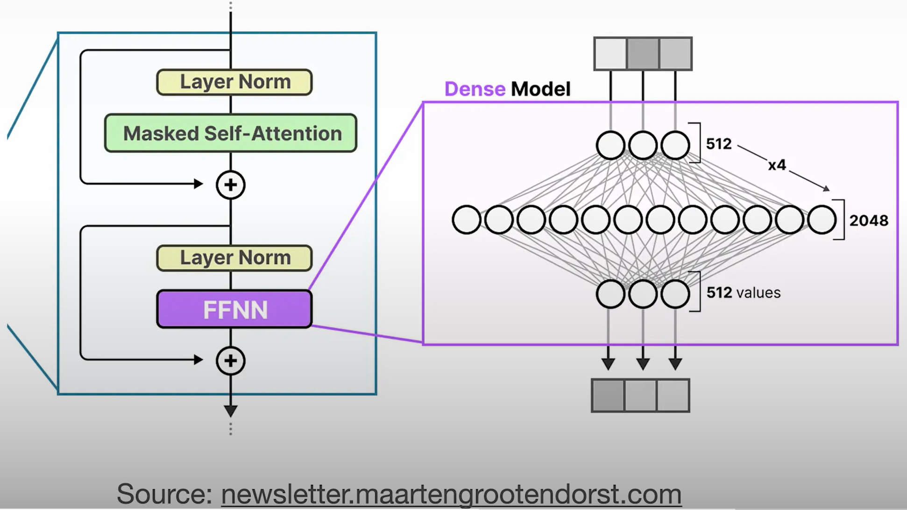
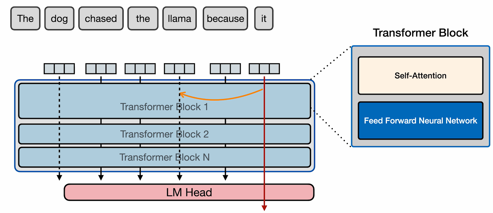
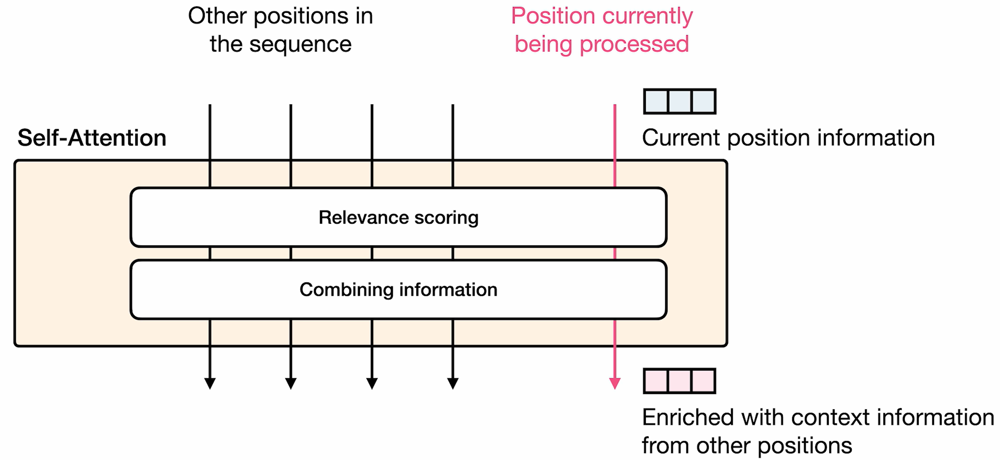

# The Transformer Block

## Transformer LLM

## Transformer Block: Feedforward Neural Network Intuition

- Intuition:
  - Storage of information and statistics
  - Based on that it would be able to predict the next probable word.
    - In the case of "The Shawshank" the next probable word would be "Redemption" because of the famous movie.

## Transformer Block: Self Attention

- Attention allows us to incorporate relevant information from the context
- Coreference Resolution
  
- Self-Attention achieves
  - Relevance Scoring
    - Computes context relevance of other tokens
  - Combining Information
    - Combine the relevance into the vector representation of current token

  
