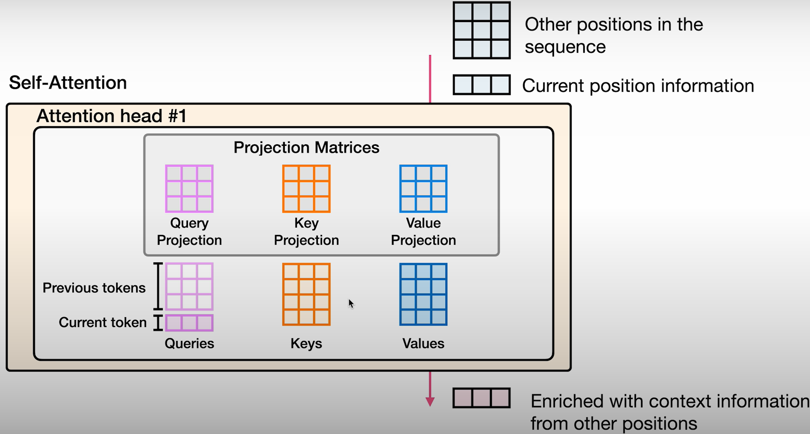
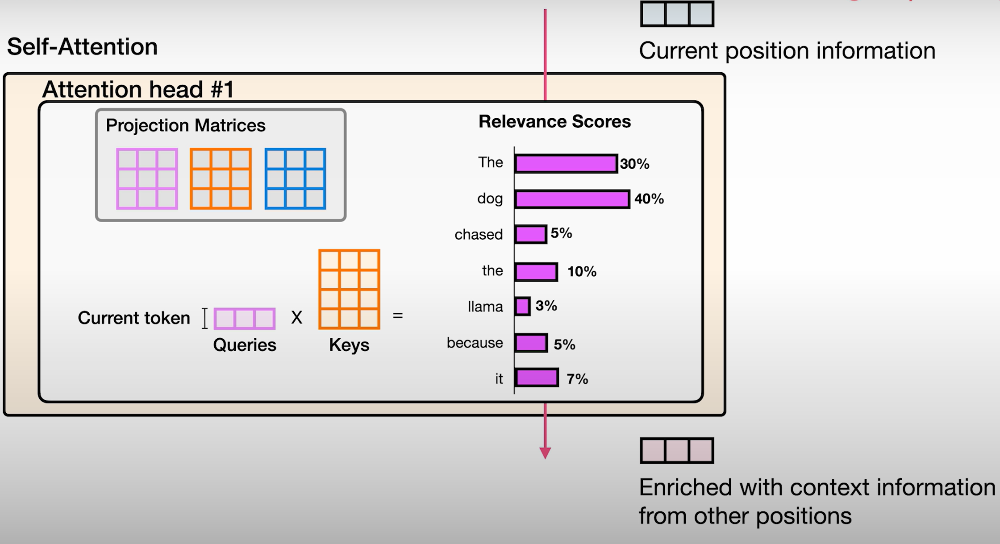
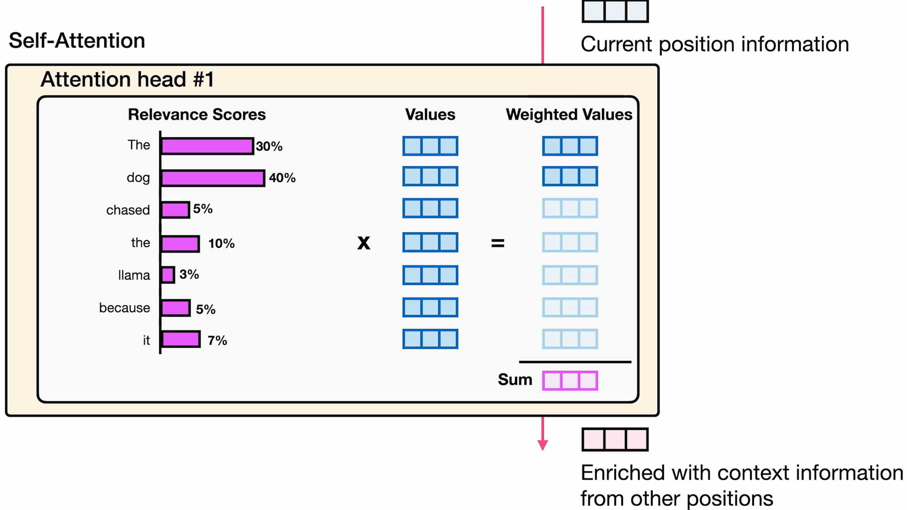
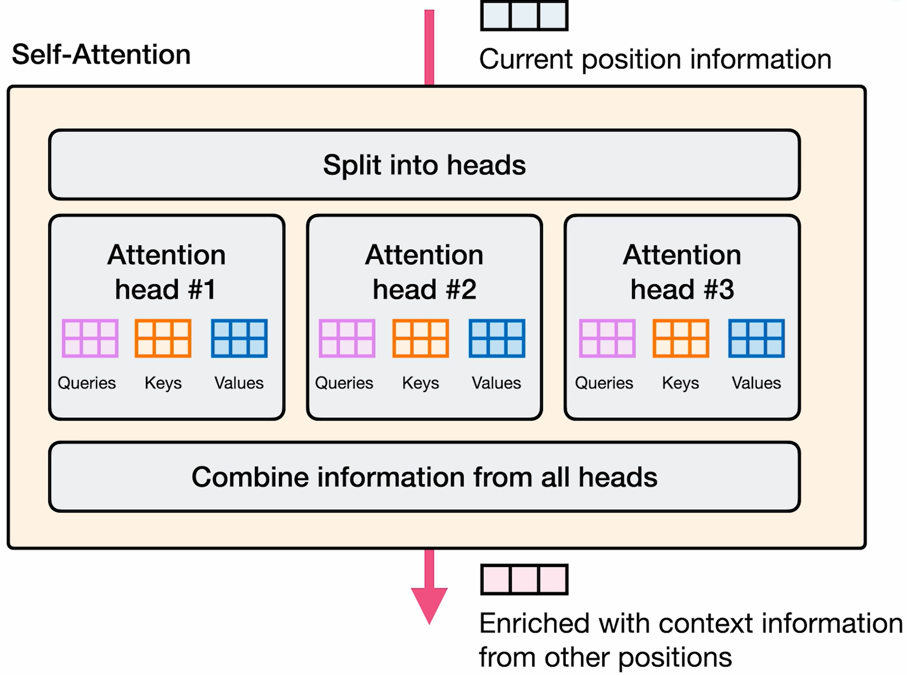
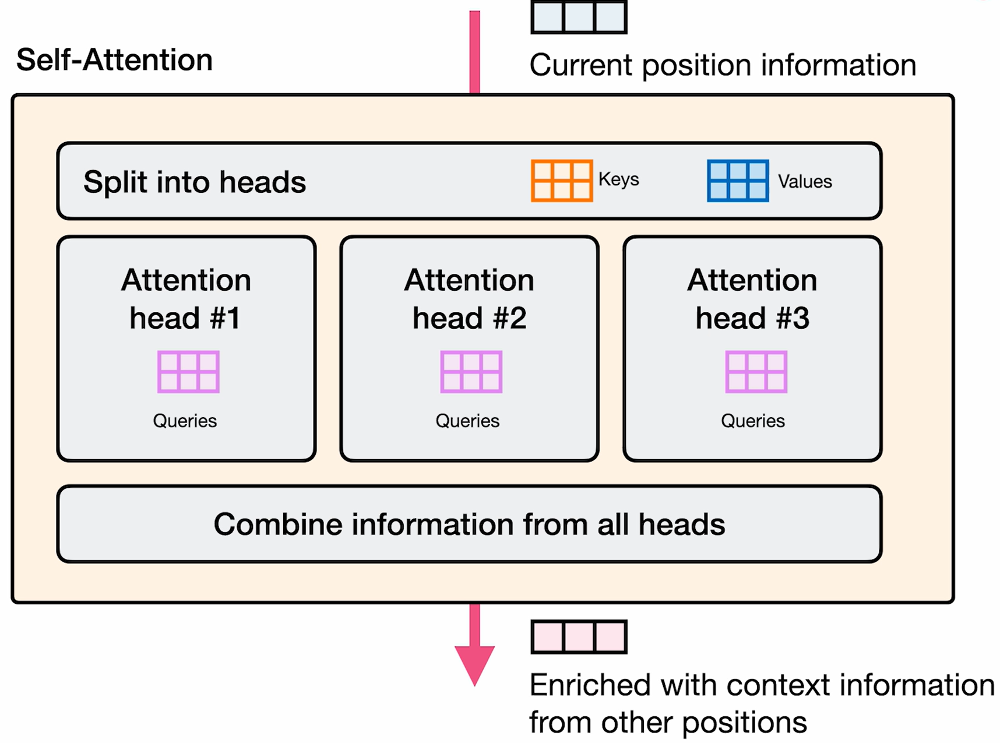
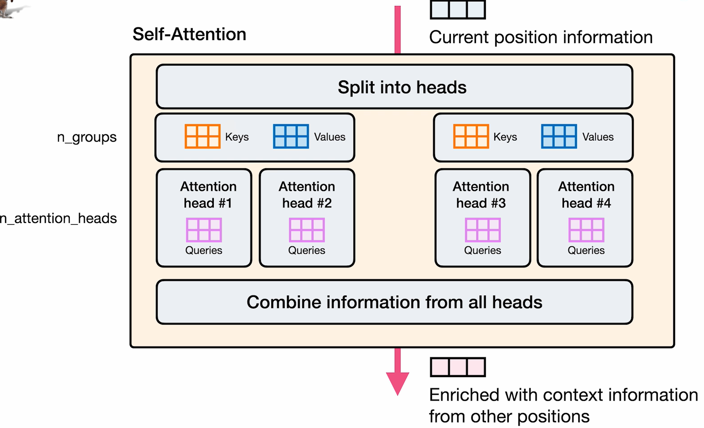
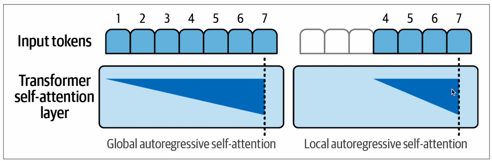
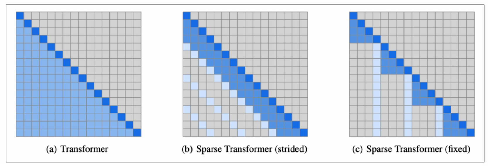
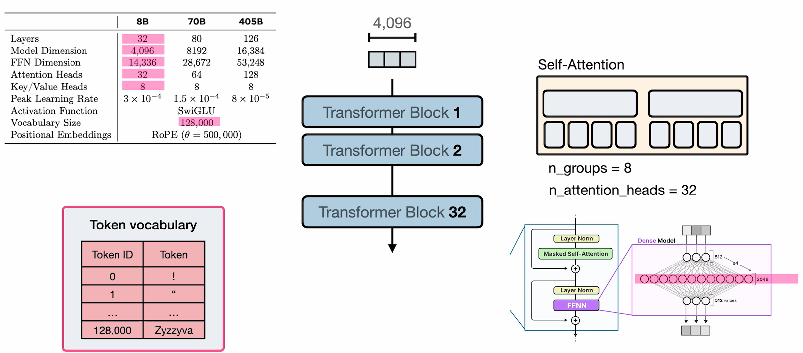

# Self-Attention

- Projection Matrices

- End goal of Relevance Scoring
  

- Recommended Course on Attention
  - [Attention in Transformers: Concepts and Code in PyTorch](https://github.com/kaushikacharya/Attention_in_Transformers_Concepts_and_Code)

- Combining Information from other tokens
  

## Multi-Head Attention

- Each Attention Head has its own Key, Query, Value matrices

## Multi-Query Attention

- One of the approaches for efficient computation of self-attention
- Self-attention component contributes a major chunk of computation

- Shared Key and Values matrix for each transformer block
- Can be visualized as compression of parameters

## Grouped-Query Attention

- Instead of single Keys and Values matrix, it has same as number of groups.
- Works better than Multi-Query Attention for large models.

## Sparse Attention

- Local attention boosts performance of large models by only paying attention to a small number of previous positions.
- This need not be applied to all the layers.
  - First layer can attend to all previous positions.
  - But interleaved layers can attend to a small number of previous positions.

- Full attention vs Sparse attention
  
- Source: [Generating Long Sequences with Sparse Transformers by Child et al (2019)](https://arxiv.org/abs/1904.10509)

## Ring Attention

- Uses multiple devices to scale to a near infinite context window
- Referred blog: [Coconut Mode](https://coconut-mode.com/posts/ring-attention/)

## Paper: The Llama 3 Herd of Models

- 8B parameter model's hyperparameters visualization
  
- ?? How is FFN dimension matching in visualization?
